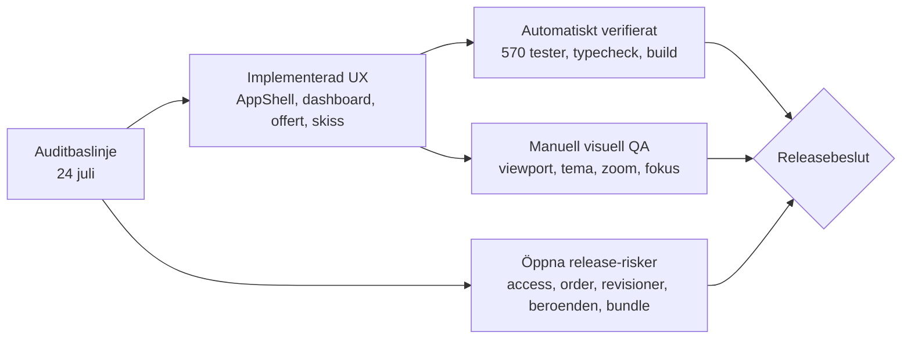

# Revaliderad nulägesbild — QuoteGenerator

**Datum:** 2026-07-27  
**Branch och HEAD:** `main` / `5bc9f83`  
**Arbetskopia:** omfattande ocommittade användar- och implementationändringar; statusen nedan gäller exakt denna arbetskopia och ska inte tillskrivas HEAD ensam.  
**Baslinje:** [PROJECT_AUDIT.md](./PROJECT_AUDIT.md)  
**Visuell implementation:** [IMPLEMENTATION_OVERVIEW.md](./IMPLEMENTATION_OVERVIEW.md)  
**Manuell visuell QA:** [design-qa.md](../../design-qa.md)

## Slutsats

Kärnupplevelsen är tydligt smidigare: projektet har ett gemensamt rollstyrt appskal, en kompakt adminstartsida, en enklare `Mer`-meny, en säkrare offertstart, tydligare stegnavigation, förbättrad leveranshierarki och stängd sketch-only-lucka. Den lokala fullsviten, typkontrollen och produktionsbygget är gröna.

Projektet bör ändå inte betraktas som releaseklart utan riskacceptans. Default-deny saknas, orderförfrågningar är fortfarande klientauktoritativa, revisioner är muterbara, CI kör inte fullsviten och den initiala bundlen är fortsatt tung. Den visuella fidelityn är dessutom uttryckligen väntande på användarens manuella kontroll.

## Visuell överblick

## Status per audit-ID

| ID | Prio | Nuläge | Evidens i arbetskopian | Kvarstående arbete |
| --- | --- | --- | --- | --- |
| S1 | P1 | Delvis klar | `getQuoteStateStorageKey(ownerUid)` använder UID-nyckel och `QuoteProvider` remountas vid UID-byte; persistence- och contexttester passerar | Migrera eller avveckla legacy-nyckeln, besluta retention vid logout och lägg integrerat konto A → logout → konto B-test |
| S2 | P1 | Öppen | `AuthContext.tsx` och `accessControl.shared.ts` ger fortfarande okänd autentiserad användare `quote-only` | Inför default-deny och serverstyrd provisionering |
| S3 | P1 | Öppen | `orderRequestService.ts` skriver direkt från klienten; Firestore rules verifierar inte retailerprofil, produktlinjer, rabatt, revision eller omräknad total | Flytta skapandet till en serverauktoritativ gräns och räkna om från sparad revision |
| S4 | P1 | Öppen | Firestore rules tillåter fortfarande ägare att uppdatera och radera revisioner | Gör revisioner create-only och skapa ett immutabelt orderägt snapshot |
| S5 | P1 | Klar för access | Både simple och advanced sketch vaktar `canExportSketchToQuote`; riktade tester passerar | Separera eventuellt spara från lämna om produktflödet kräver två skilda avsikter |
| S6 | P1 | Öppen | `npm audit --omit=dev` rapporterar 16 advisories; `vite.config.js` har `sourcemap: true` | Reachability-bedöm, patcha/ersätt paket, besluta sourcemap-policy och inför audit-gate |
| Q1 | P1 | Delvis klar | Fullsviten är lokalt grön med 77 filer och 570 tester | Ändra CI från enbart `test:confidence` till fullsvit eller en uttryckligt likvärdig gate |
| Q2 | P1 | Öppen | Login preloaddar fortfarande React-, jsPDF- och Firebase-chunks; cirka 532,3 kB gzip i aktuellt preload-underlag | Lazy-loada routes/exporter, rätta chunkindelningen och inför bundlebudget |
| U1 | P1 | Klar | Dashboard och header skiljer mellan fortsätt utkast och ny offert; ny start har bekräftelse | Följ upp med användningsdata och felstartsfrekvens |
| U2 | P1 | Klar | Gemensamt `AppShell`, rollnavigation, mobil drawer och offertkontext används på skyddade routes | Manuell kontroll vid små viewports och 200 % zoom återstår |
| U3 | P1 | Delvis klar | Sammanställningen har tydligare hierarki och separat retailerorder | En enda sammanslagen ”Spara och skapa PDF” är inte implementerad; validera om nuvarande tvåstegshierarki räcker |
| D1 | P1 | Delvis klar | Semantiska tokens, global fokusstil, reduced motion och primitives finns | Migrera återstående hårdkodade specialytor och komplettera saknade primitives |
| A1 | P2 | Delvis klar | Quote persistence och PDF-preview är debounced; senaste giltiga preview behålls | Dela större state-/renderingsansvar och mät faktisk input- och previewlatens |
| A2 | P2 | Öppen | `strict: false`, ingen full lint-gate och flera stora ansvarskluster kvarstår | Inför strict stegvis, lint och komponent-/domänuppdelning |

## Vald adminlösning

Den senare produktinriktningen ersätter auditens ursprungliga idé om en dashboard utan destinationsgenvägar. Adminstartsidan har nu sex kompakta launchers som ett medvetet snabbstartslager:

1. Skapa eller fortsätt offert
2. Sälj-CRM
3. Lagersaldo
4. Rita uteservering
5. Aktivitetslogg
6. Planering

Detta konkurrerar mindre med headern än den tidigare lösningen eftersom launchers är låga, enhetliga och uppgiftsorienterade. Headern ansvarar fortsatt för beständig global navigation, medan `Mer` samlar mindre frekventa destinationer i en enkelkolumnsmeny.

### Implementationsacceptans

| Krav | Status | Verifiering |
| --- | --- | --- |
| Exakt sex adminverktyg och rätt callbacks | Verifierat | Dashboard- och routingtester |
| `Skapa ny offert` ↔ `Fortsätt offert` | Verifierat | Dashboard-, persistence- och routingtester |
| Tre orderrader och tre aktivitetsrader | Verifierat | Dashboardtester |
| Loading, fel, retry, tomdata, `Okänd tid` och negativa belopp | Verifierat | Dashboardtester |
| Kompakt `Mer`, fast synlig text, accessfilter och tangentbord | Verifierat | AppShell-, routing- och navigationstester |
| Oförändrade strukturer för övriga roller | Verifierat i komponenttest | Retailer-, quote-only-, sketch-only- och fallbackfall |
| 1440/1024/768/390, båda teman, 200 % zoom och faktisk pixel-fidelity | Väntar på manuell kontroll | `design-qa.md` är korrekt markerad `blocked` |

## Verifiering 2026-07-27

| Kontroll | Resultat |
| --- | --- |
| Riktade UX-/IA-tester | 12 filer, 106 tester godkända |
| Full Vitest-svit | 77 filer, 570 tester godkända |
| Confidence-svit | 15 filer, 180 tester godkända |
| TypeScript | Godkänd |
| Produktionsbygge | Godkänt; 6 804 moduler transformerade och chunkvarning kvarstår |
| Produktionsberoenden | 16 advisories: 2 critical, 8 high, 6 moderate |
| CI-konfiguration | Kör fortfarande confidence, typecheck och build; inte fullsviten |

Transformerat modulantal dokumenteras endast som körbevis. Det är inte ett prestandamått; preload- och chunkstorlekar är den relevanta bundleevidensen.

## Nya UX-stickprov efter implementationen

Följande observationer ändrar inte acceptansen för den beställda adminstartsidan, men bör ligga i nästa förbättringsbacklogg:

- Offertprogressen etiketterar tidigare steg som `Klart` utifrån stegordning, inte en separat verifierad completion-state. `Tidigare` är en säkrare etikett tills riktig completion-data finns.
- Advanced Sketch har fortfarande en lokal `window.confirm`-väg. Den bör migreras till projektets gemensamma bekräftelsetjänst.
- Gemensamma primitives finns för `Button`, `Panel`, `PageHeader`, `StatusChip` och `Modal`, men motsvarigheter till `Field`, `IconButton`, `AsyncState` och responsiva datalistor saknas.
- Den valda målbilden visar en nedåtriktad indikator i `Mer`-knappen. Implementationen har fast text och fullständigt tangentbordsbeteende men ingen synlig indikator; detta bör bedömas i den manuella visuella kontrollen.
- Nuvarande kod använder `xlsx` för Excel-export. Någon `XLSX.read`-väg för användaruppladdade arbetsböcker hittades inte, så beroendets praktiska reachability ska bedömas utifrån exportflödet.

## Evidensgräns

- De skyddade vyerna har inte jämförts pixelmässigt i en autentiserad browser-session i denna leverans.
- Före-bilder och vald målbild är versionsbara och visas i [IMPLEMENTATION_OVERVIEW.md](./IMPLEMENTATION_OVERVIEW.md).
- Ingen aktuell implementationsbild får presenteras som granskad förrän användaren har gjort den valda manuella kontrollen.
- Kod-, komponent-, routing-, access-, typecheck- och byggbevis täcker beteendet men ersätter inte visuell eller skärmläsarbaserad runtime-QA.
