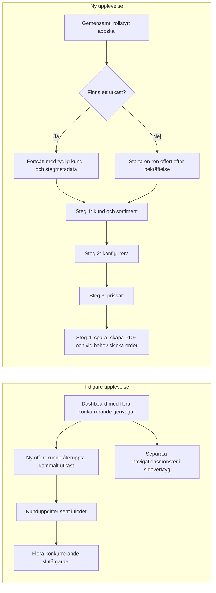
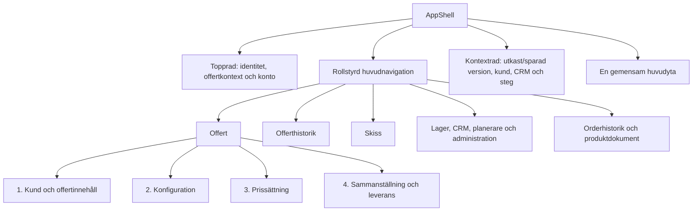
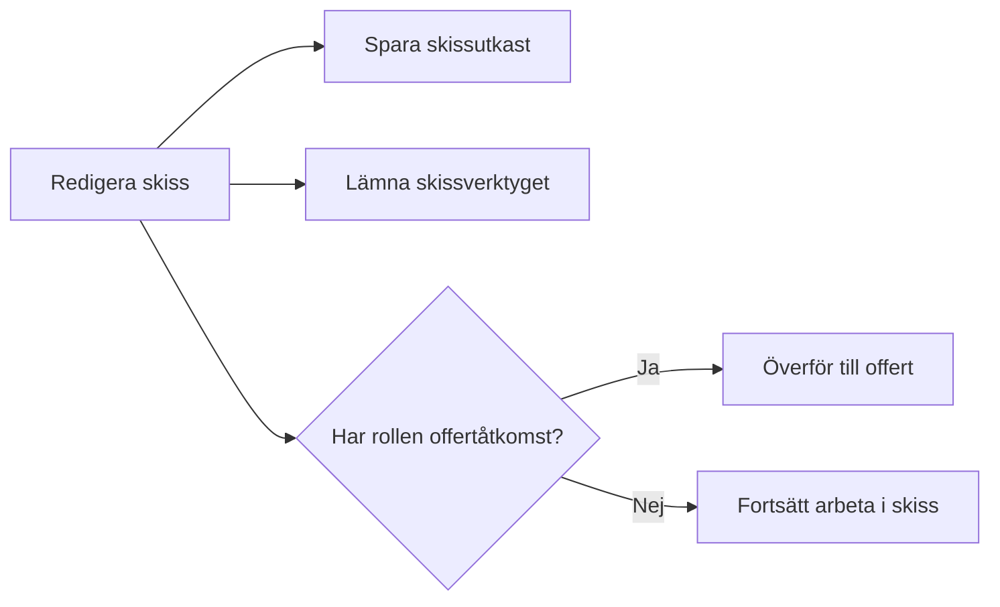
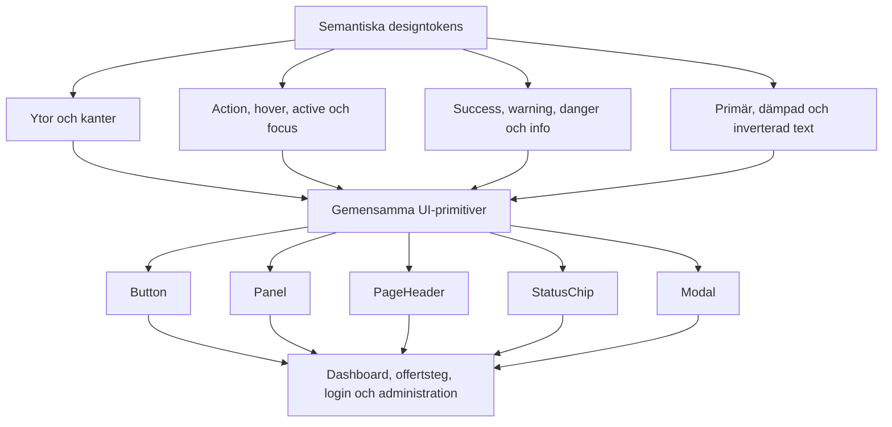
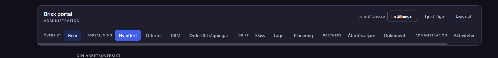
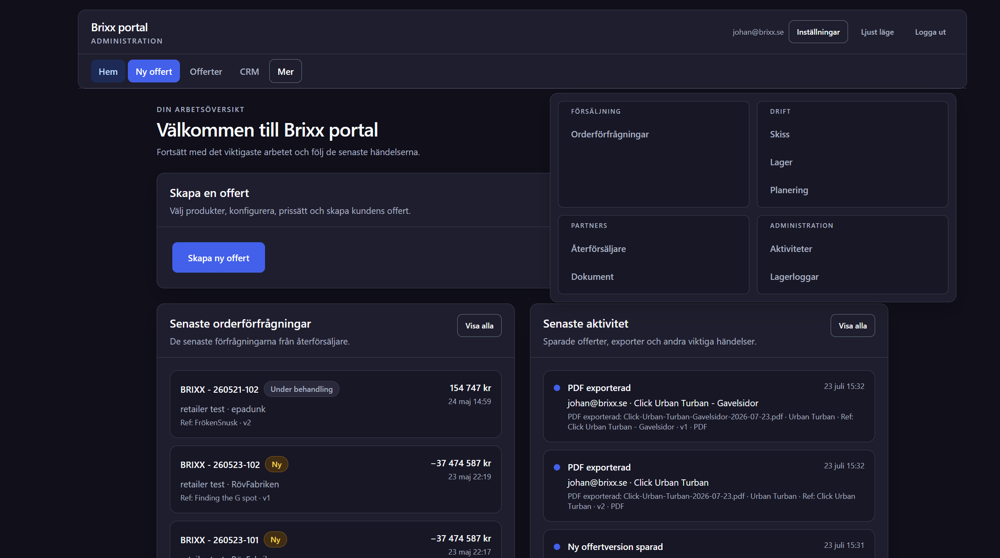
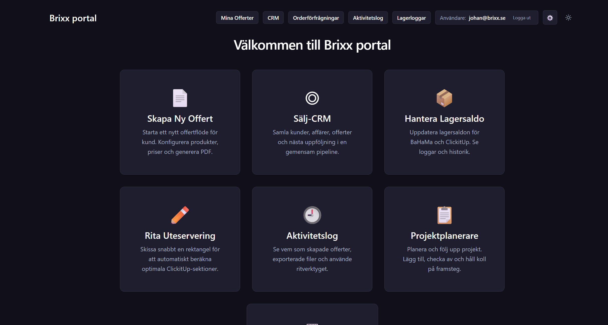
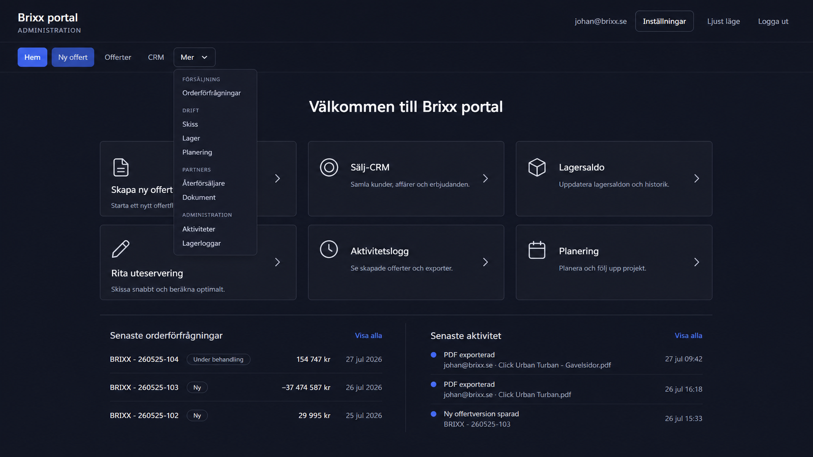

# Implementerad UX- och designförbättring — QuoteGenerator

**Datum:** 2026-07-27  
**Underlag:** [PROJECT_AUDIT.md](./PROJECT_AUDIT.md)  
**Syfte:** visuell översikt över det förbättrade flödet, den nya informationsarkitekturen och designstrukturen.

Den revaliderade statusen för samtliga audit-ID:n finns i [CURRENT_STATE_ADDENDUM.md](./CURRENT_STATE_ADDENDUM.md). Den ursprungliga auditen är en historisk baslinje; denna översikt beskriver den aktuella, ocommittade implementationen.

## Före och efter

## Ny informationsarkitektur

Navigation och direkt route-access är fortfarande separata kontrakt. Appskalet visar bara relevanta destinationer för rollen, medan `src/navigation/routes.ts` fortsätter att vara säkerhets- och routekällan.

## Förbättrat offertflöde

| Moment | Ny lösning | Förväntad effekt |
| --- | --- | --- |
| Start | Dashboarden skiljer på **Fortsätt offert** och **Ny offert** och visar kund och aktuellt steg | Färre oavsiktliga fortsättningar på fel kund |
| Steg 1 | Kunduppgifter och produktlinje väljs tillsammans | Rätt kontext finns innan konfigurering börjar |
| Stegstatus | URL-baserad progress visar aktuellt, färdigt och otillgängligt steg | Tydligare orientering utan att kringgå draft-vakter |
| Navigering | En gemensam fast åtgärdsrad i konfiguration och prissättning | Nästa och föregående åtgärd finns på samma plats |
| Sammanställning | Osparad offert har en primär sparåtgärd; sparad offert prioriterar PDF | Färre konkurrerande primärknappar |
| Retailerorder | Order är ett separat moment efter sparad version | Tydligare skillnad mellan offertleverans och order |
| PDF-förhandsvisning | Uppdateras efter en kort paus och behåller senaste giltiga förhandsvisning | Mindre flimmer och mindre arbete per tangenttryckning |

## Förbättrat skissflöde

- Enkel och avancerad skiss behåller sina respektive utkast vid navigering och avmontering.
- Byte av läge raderar inte längre den andra skissens utkast.
- **Spara och gå tillbaka** är skilt från **överför till offert**; spara och lämna är fortfarande en kombinerad åtgärd.
- `sketch-only` kan inte längre orsaka en överföring till offertstate.

## Ny designstruktur

### Designprinciper som nu är kodifierade

- Actionfärg och BRIXX-brand är separata roller.
- Formulärkontroller har en tydligare kant än vanliga avdelare.
- Statusfärger har egna text-, bakgrunds- och kantvärden i båda teman.
- Tangentbordsfokus är synligt globalt, även i redigerbara ytor.
- Rörelser minskas när användaren har aktiverat reducerad rörelse.
- Gemensamma `Modal`-dialoger har fokuslåsning, Escape, fokusåterställning och scrollås; äldre bekräftelsevägar återstår att migrera.
- Dashboarden använder Tablers ikonpaket utan emoji; enstaka äldre specialytor använder fortfarande textglypher.
- Admin-dashboarden har sex avsiktligt valda, kompakta snabbstartskort. De är ett arbetslager för vanliga uppgifter; headern förblir den beständiga globala navigationen.

## Leveransstatus mot auditen

| Auditområde | Status | Genomförd förändring |
| --- | --- | --- |
| S1: lokal dataisolering | Delvis klar | UID-isolerad persistence och provider-reset vid UID-byte finns; legacy-migrering och ett integrerat konto A → logout → konto B-test återstår |
| U1: otydlig offertstart | Klar | Utkastmetadata, fortsätt/ny och bekräftad ersättning |
| U2: splittrad navigering | Klar | Gemensamt AppShell, rollnavigation, mobil drawer och offertkontext |
| U3: konkurrerande slutåtgärder | Delvis klar | Tydligare CTA-hierarki för spara, PDF och retailerorder; en sammanslagen ”Spara och skapa PDF” är inte införd |
| S5: skissens roll-/avsiktslucka | Klar för access | Accessvakt och separat offertöverföring; spara/lämna är fortfarande kombinerade |
| D1: tokens, fokus och dialoger | Delvis klar | Semantiskt tokensystem och gemensamma primitives finns i kärnflödet; äldre specialytor behöver fortsatt migrering |
| A1: tung PDF-preview | Delvis klar | Preview är debounced; större state-uppdelning är fortsatt arkitekturarbete |
| S2–S4: serverauktoritet | Öppna P1-risker | Ej del av UX-leveransen; kräver policybeslut, Firebase Functions/rules och migreringsplan |
| S6: beroenden | Öppen P1-risk | Ej del av UX-leveransen; kräver separat dependency- och reachability-arbete |
| Q1: fullsvit i CI | Delvis klar | Fullsviten är grön lokalt; CI kör fortfarande endast confidence-sviten |
| Q2: initial bundle | Öppen | PDF-, Firebase- och React-vendor preloaddas fortfarande på login och bundlebudget saknas |
| A2: ändringskostnad | Öppen | Strict TypeScript, lint och uppdelning av stora ansvarskluster återstår |

## Verifieringspunkter

| Kontroll | Resultat |
| --- | --- |
| Typkontroll | Godkänd 2026-07-27 |
| Full Vitest-svit | 77 testfiler och 570 tester godkända 2026-07-27 |
| Confidence-svit | 15 testfiler och 180 tester godkända 2026-07-27 |
| Produktionsbygge | Godkänt 2026-07-27, 6 804 moduler transformerade; chunkvarning kvarstår |
| Textkodningsvakt | Godkänd |
| Git-säkerhetskontroll | Godkänd; inga blockerade känsliga eller lokala filer är spårade |
| Riktade UX-/IA-regressioner | 12 testfiler och 106 tester godkända 2026-07-27 |
| Produktionsberoenden | 16 advisories: 2 critical, 8 high och 6 moderate 2026-07-27 |

Den visuella runtime-granskningen av skyddade vyer kräver en autentiserad testroll. Källkod, renderingstester, interaktionstester och byggverifiering täcker därför leveransen tills en sådan session används för manuell zoom-, skärmläsar- och viewportkontroll.

Produktionsbygget varnar fortsatt för att `react-vendor` överstiger 500 kB före gzip. Det är inte ett byggfel, men bundlebudget och ytterligare koddelning bör behandlas i den separata prestandafasen.

## Visuellt beslutsunderlag

### Före: header med överfull navigation

### Före: klumpig adminstartsida

### Användarens enklare referens

### Vald riktning

Den browser-renderade implementationen är ännu inte infogad eftersom den visuella kontrollen uttryckligen görs manuellt. [design-qa.md](../../design-qa.md) förblir därför blockerad tills en jämförbar implementationsbild och manuell acceptans finns.
