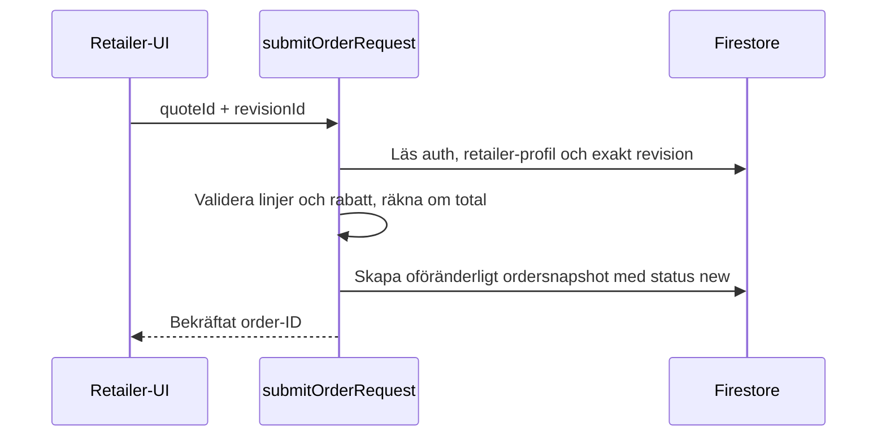
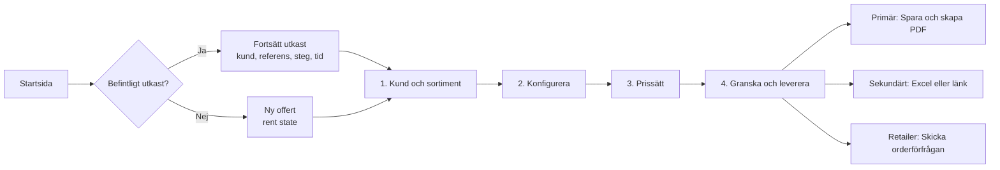
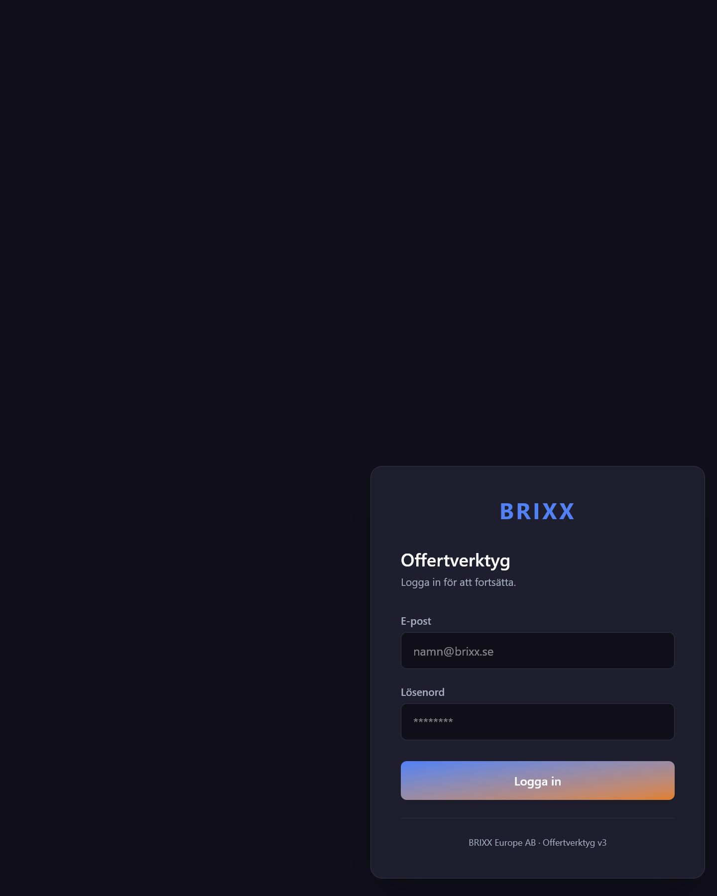

# Komplett projekt- och produkt-audit — QuoteGenerator

**Datum:** 2026-07-24  
**Branch och commit:** `main` / `5bc9f83`  
**Granskad yta:** aktuell checkout, applikationsarkitektur, Firebase-regler, dataflöden, beroenden, bygg, tester, prestanda, huvudresor, informationsarkitektur, visuellt system och tillgänglighetsstickprov.

> **Historisk baslinje.** Dokumentet beskriver checkouten den 24 juli 2026. Det har bevarats som auditens ursprungliga bevis och ska inte läsas som status för de ocommittade förbättringarna den 27 juli. Se [CURRENT_STATE_ADDENDUM.md](./CURRENT_STATE_ADDENDUM.md) för revaliderad status, aktuella verifieringar och kvarstående risker.

## Sammanfattning

QuoteGenerator har en stark domängrund: URL-baserad routing, centraliserade accessregler, ett begripligt offertflöde i fyra steg, robust state-hydrering, revisionshistorik, språk- och PDF-teman samt ovanligt bred enhetstestning för ett internt verktyg.

Projektet är däremot **inte redo för en okritisk release** i nuvarande skick. Det beror främst på fyra saker:

1. Kund-, offert-, lager- och skissdata lagras i samma lokala nyckel för alla användare i webbläsaren.
2. Flera viktiga affärsregler för återförsäljarorder och revisioner litar på klienten i stället för en servergräns.
3. CI kan vara grönt trots att den fulla testsviten är röd.
4. Navigationsmodellen, sammanställningen och det visuella systemet har vuxit utan ett gemensamt appskal eller en tillräckligt komplett uppsättning UI-primitiver.

Jag hittade ingen källkodsbekräftad pågående incident som motiverar P0. Flera P1-fynd bör ändå behandlas som releaseblockerare tills de har validerats och åtgärdats.

### Övergripande hälsa

| Område | Hälsa | Bedömning |
| --- | --- | --- |
| Domänlogik och funktionsbredd | Stark | Mycket funktionalitet, tydlig offertmodell och bra revisions-/exportstöd |
| Routing och grundläggande access | Stark | URL-first, central metadata och separata access-/draft-vakter |
| Dataisolering och servergränser | Kritisk förbättring behövs | Lokal state är inte UID-isolerad och orderflödet är för klientauktoritativt |
| Releasekvalitet | Kritisk förbättring behövs | Fullsviten fallerar men körs inte i CI |
| Kärnflöde för offert | God grund, märkbar friktion | Fyra steg fungerar mentalt, men start, stegstatus och leverans behöver förenklas |
| Informationsarkitektur | Ojämn | Header, dashboard, CRM, lager och planerare använder konkurrerande navigationsmönster |
| Design och tillgänglighet | Systematiskt arbete behövs | Ofullständiga tokens, kontrastproblem och inkonsekventa fokus-/dialogmönster |
| Prestanda | Förbättring behövs | Tung initial preload och PDF/localStorage-arbete på varje kundfältsändring |
| Underhållbarhet | Förbättring behövs | Flera filer över 1 000 rader, monolitisk state och `strict: false` |

## Det som redan är bra

- `src/navigation/routes.ts` fungerar som en tydlig källa för vägar, access och draft-krav.
- Route access och quote draft access är separerade, vilket gör modellen lättare att resonera om.
- Quote state har versionerad migrering och bred testtäckning.
- Offertsparande använder transaktioner och revisionsmodellen är väl integrerad i UI:t.
- Retailer-UI:t filtrerar produktlinjer, klampar rabatter och normaliserar PDF-teman.
- Intern marginalanalys ligger utanför sparad quote state och visas endast för administratörer.
- CRM har projektets mest sammanhållna loading-, error- och empty-state-mönster.
- Den delade bekräftelsedialogen har fokuslåsning, Escape-hantering och fokusåterställning.
- TypeScript-kontrollen och produktionsbygget passerar i aktuell checkout.
- 474 av 475 insamlade tester passerar, vilket visar att den befintliga domänlogiken har en bra grund.

## Prioriterade fynd

Prioriteringen används så här:

- **P0:** bekräftad aktiv incident, pågående dataläckage eller blockerande dataförlust.
- **P1:** hög affärs-/säkerhetspåverkan eller releaseblockerare.
- **P2:** tydlig påverkan på effektivitet, tillgänglighet, prestanda eller ändringsrisk.
- **P3:** polish, konsekvens och långsiktig förbättring.

| ID | Prio | Verifierat fynd | Effekt | Första åtgärd |
| --- | --- | --- | --- | --- |
| S1 | P1 | Lokal quote state använder en global nyckel och rensas inte vid logout | Nästa användare på samma webbläsare kan ärva föregående användares data | Nyckel per UID, reset vid auth-byte/logout och migrering av befintligt utkast |
| S2 | P1 | Okänd autentiserad användare faller tillbaka till `quote-only` | Föräldralösa eller externt skapade Auth-konton kan få offertåtkomst | Explicit default-deny och serverstyrd provisionering |
| S3 | P1 | `order_requests` validerar inte retailer-profil, linjescope, rabatt, revision eller total | Orderdata kan avvika från den sparade offerten | Serverfunktion som läser revision/profil och räknar om ordern |
| S4 | P1 | Offertrevisioner får uppdateras och raderas av ägaren | En inskickad order kan senare peka på ändrat eller saknat underlag | Gör revisioner create-only och skapa orderägt snapshot |
| S5 | P1 | Avancerad skiss kan skriva till offertstate utan samma rollkontroll som enkel skiss | `sketch-only` kan få sidoeffekter utanför avsedd roll | Separera spara, lämna och överför; dölj överföring för rollen |
| S6 | P1 | `npm audit --omit=dev` rapporterar 16 produktionsadvisories | 2 critical, 8 high och 6 moderate behöver reachability-bedömas | Patcha/ersätt direkta paket och inför en dokumenterad audit-gate |
| Q1 | P1 | CI kör 15 confidence-filer, medan fullsviten har två felaktiga suites | Ett grönt CI motsvarar inte faktisk testhälsa | Reparera felen och kör fullsviten i CI |
| Q2 | P1 | Login preloaddar cirka 523,8 kB gzip inklusive Sketch-/PDF-relaterad kod | Långsammare första användbara vy, särskilt på svagare klienter | Rätta manual chunks, lazy-loada alla routes och sätt bundlebudget |
| U1 | P1 | “Ny offert” kan fortsätta ett gammalt utkast utan tydlig avsikt | Risk för fel kund/offert och osäker start | Visa “Fortsätt utkast” eller “Ny offert” med tydlig metadata |
| U2 | P1 | Lagerlogglänken använder fel route och lager har eget mobilt navigationslås | Trasig väg och svår åtkomst på mindre skärmar | Fixa länken och flytta lager till gemensamt appskal |
| U3 | P1 | Sammanställningen har flera konkurrerande primäråtgärder | Otydlig avslutning och högre felrisk | En primär “Spara och skapa PDF”; sekundära val i meny |
| D1 | P1 | Färgtokens, fokusmönster och kontrast är inkonsekventa | Centrala kontroller blir svårare att uppfatta och använda | Semantiskt tokensystem och gemensamma primitives |
| A1 | P2 | Hela quote state serialiseras på varje dispatch och PDF-preview regenereras per tecken | Onödigt CPU-/I/O-arbete och risk för skriv-/renderingslagg | Debounce/idle-persistens, separata stores och defererad preview |
| A2 | P2 | `strict: false`, ingen lint och flera filer över 1 000 rader | Hög ändringsrisk och svagare typgarantier | Inför strict per domän och dela ansvar stegvis |

## Säkerhet, behörighet och data

### S1. Offertutkast är inte isolerade per användare

Samma localStorage-nyckel, `offertverktyg_state`, används för alla konton:

- `src/store/quoteStateSchema.ts:27`
- `src/store/quoteStatePersistence.ts:8-40`
- `src/store/QuoteContext.tsx:130-139`

Utloggning i `src/components/layout/Header.tsx:42-45` loggar ut från Firebase men återställer inte QuoteState. State innehåller bland annat kunduppgifter, offertdata, lagerdata och skisser.

**Rekommenderat kontrakt:**

1. Lagra under `offertverktyg_state:{uid}`.
2. Byt store atomärt när Firebase-UID ändras.
3. Rensa minnesstate på logout innan navigation.
4. Migrera den gamla globala nyckeln först efter uttryckligt användarval.
5. Lägg TTL och synlig text för “senast sparat lokalt”.
6. Flytta administrativt lagercache till en separat store.

**Acceptanstest:** logga in som användare A, skapa kundutkast, logga ut, logga in som B och verifiera att inga fält, skisser eller lagerdata från A finns kvar.

### S2. Accessmodellen bör vara default-deny

`src/store/AuthContext.tsx:49-75` faller tillbaka till `quote-only` när en autentiserad användare inte matchar admin, sketch-only eller retailer.

Retailer skapas dessutom i två klientsteg:

- Firebase Auth-konto via `src/services/authService.ts:12-21`
- Retailer-profil via `src/views/RetailerManager.tsx:406-428`

Borttagning i `src/services/retailerService.ts:190-206` raderar profilen, inte Auth-kontot. Detta kan skapa föräldralösa konton. Om publik e-post-/lösenordsregistrering är aktiverad i Firebase kan externa konton också nå fallbacken; den driftsinställningen har inte verifierats i denna audit.

**Rekommendation:** använd en backend/Admin SDK för provisionering och avregistrering, bind roll/profil till UID och returnera `guest/denied` när ingen godkänd roll finns.

### S3–S4. Order och revisioner behöver en serverauktoritativ gräns

`firestore.rules:409-430` tillåter skapande av `order_requests` utan att verifiera:

- att retailer-ID:t motsvarar inloggad retailer-profil,
- att produktlinjerna är aktiverade,
- att rabatten håller sig inom gränsen,
- att quote/revision finns och ägs av användaren,
- att totalen motsvarar serverns beräkning,
- att dokument-ID:t är deterministiskt,
- att initial status alltid är `new`.

Samtidigt tillåter `firestore.rules:463-485` ägaren att uppdatera och radera revisioner. Admin kan därför senare läsa ett annat underlag än det som gällde när ordern skickades.

**Rekommenderad transaktion:**



Gör revisioner create-only för användaren. Om revisioner behöver “rättas”, skapa en ny revision i stället för att mutera historik.

### S5. Avancerad skiss har en roll- och avsiktslucka

`src/config/accessControl.shared.ts:88` säger att `sketch-only` inte får exportera skiss till offert. Den avancerade editorn skriver ändå till offertval och konfigurering i `src/components/features/AdvancedSketch/AdvancedSketchEditor.tsx:661` utan motsvarande kontroll.

Knappen “Spara & Tillbaka” kan dessutom både spara och överföra, vilket gör sidoeffekten svår att förutse.

**Föreslaget upplägg:**

- “Spara skissutkast”
- “Tillbaka”
- “Överför till offert” — endast när `canExportSketchToQuote` är sann

### S6. Beroenden och publika sourcemaps

`npm audit --omit=dev` rapporterade:

- 2 critical
- 8 high
- 6 moderate

Direkta paket som berörs är bland andra `jspdf`, `xlsx`, `react-router-dom` och `firebase`. Auditklassningen är **inte** bevis för att varje advisory är exploaterbar i denna SPA; varje kodväg måste reachability-bedömas. `xlsx` förtjänar särskild prioritet eftersom applikationen läser användarlevererade arbetsböcker.

`vite.config.js:16-18` bygger samtidigt publika sourcemaps och Firebase hosting publicerar hela `dist`. Lokal build innehöll 39 sourcemaps och cirka 11,8 MB kartdata enligt bygginspektionen.

**Rekommendation:**

1. Uppgradera patchbara direkta paket.
2. Ersätt eller isolera paket utan säker uppgraderingsväg.
3. Lägg parsergränser, filstorleksgräns och timeout runt XLSX-import.
4. Stäng av publika sourcemaps eller använd privata/hidden maps i felspårning.
5. Flytta konfidentiella katalog-/marginaldata från publika klientbundles om de ska vara hemliga.
6. Lägg Dependabot/Renovate och en riskbaserad audit-gate i CI.

## Rekommenderat informationsupplägg

### Ett gemensamt, rollstyrt appskal

Nuvarande system blandar global header, stora dashboardkort, CRM-navigation, planerarens sidopanel och lagrets eget skal. Admin ser många likvärdiga knappar i headern, samtidigt som dashboarden upprepar samma destinationer.

Föreslagen huvudstruktur:

| Grupp | Innehåll | Synlighet |
| --- | --- | --- |
| Hem | Fortsätt arbete, uppgifter, senaste utkast och avvikelser | Alla, rollanpassat |
| Försäljning | CRM, ny offert, offertarkiv, orderförfrågningar | `full`, relevanta quote-/retailerroller |
| Drift | Planerare och lager | `full` |
| Partners | Återförsäljare och produktdokument | `full`, relevanta retailerytor |
| Administration | Aktivitet, lagerloggar och inställningar | `full` |

På desktop fungerar en smal vänsternavigation eller kompakt toppnavigation med grupper. På mobil bör samma struktur visas i en drawer. Varje destinationskontroll bör vara en riktig länk så att öppna i ny flik och webbläsarhistorik fungerar naturligt.

Dashboarden ska inte vara en andra huvudmeny. Den bör i stället prioritera:

1. **Fortsätt där du slutade** — senaste utkastet med kund, referens, steg och ändringstid.
2. **Ny offert** — startar alltid rent efter ett tydligt val.
3. **Mina uppgifter** — CRM-uppföljningar, väntande order och driftavvikelser efter roll.
4. **Senaste aktivitet** — endast det som hjälper användaren att fatta nästa beslut.

### Ett smidigare offertflöde

Behåll den starka modellen med fyra steg, men ändra innehåll och status:



Lägg en persistent offertheader ovanför alla fyra steg:

- kund och referens,
- kopplad CRM-affär,
- offertnummer eller “lokalt utkast”,
- nuvarande steg,
- sparstatus och senast sparat,
- tydlig anledning om ett senare steg är låst.

Stegvisningen bör använda `aria-current`, visa färdigt/aktivt/låst tillstånd och aldrig se klickbar ut när draft guard ändå kommer att skicka användaren bakåt.

### Förenkla sammanställning och leverans

`src/views/SummaryExport.tsx` hanterar i samma yta kunddata, villkor, summering, marginaler, sparande, PDF, Excel, länk, order och PDF-preview. Sparaåtgärden förekommer på flera platser.

Föreslagen desktoplayout:

- **Vänster:** Kund, villkor, innehåll och kompletthetskontroll i tydliga sektioner.
- **Höger:** Sticky PDF-preview och leveransstatus.
- **Primär CTA:** “Spara och skapa PDF”.
- **Sekundär meny:** Excel, kopiera länk och övriga exportalternativ.
- **Retailer:** efter sparad version visas separat bekräftelse för orderförfrågan.

Debouncea preview 300–500 ms, behåll senaste giltiga preview synlig och visa “Uppdaterar förhandsvisning…” i stället för att ersätta hela ytan.

## Design och tillgänglighetsstickprov

Detta är inte en fullständig WCAG-certifiering. Bedömningen bygger på faktisk inloggningsyta, responsivt stickprov och källkodsgranskning av centrala flöden.

### Visuellt system

`src/index.css` definierar en grund, men komponenterna använder fler semantiska namn och lokala färger än systemet täcker. Primärgul mot vit är cirka 1,9:1 i det granskade temat och bör inte användas som vanlig interaktiv textfärg.

Skapa ett komplett semantiskt lager:

- `surface`, `surface-raised`, `input`, `hover`
- `text`, `text-muted`, `text-inverse`
- `border`, `focus-ring`
- `success`, `warning`, `danger` med separata text- och bakgrundstokens
- konsekventa radius-, spacing- och elevationnivåer

Separera dekorativ varumärkesgul från tillgänglig länk-/aktionsfärg. Testa båda teman automatiskt.

### Gemensamma komponentprimitiver

Prioritera följande primitives:

- `AppShell`
- `PageHeader`
- `Button` och `IconButton`
- `Field`
- `QuoteProgress`
- `Panel`
- `StatusChip`
- `AsyncState`
- `Modal`
- `ResponsiveDataList`

Det minskar behovet av lokala varianter, emoji-ikoner, specialmodaller och inkonsekventa fokusregler.

### Konkreta tillgänglighetsproblem

- `CustomerInfoForm.tsx:38-108`: synliga labels saknar `htmlFor` och inputs saknar `id`.
- `Planner.tsx:782-805`: tilldelning är drag-only; knapparna saknar klickalternativ.
- Flera overlays saknar gemensam dialogsemantik, fokusfälla, Escape och fokusåterställning.
- Headerns quote-steg tar bort outline utan likvärdig `focus-visible`-markering.
- Loadingtillstånd saknar ofta `role="status"` eller `aria-live`.
- Global `select-none` i `index.html:14` hindrar kopiering av kunddata och offertnummer.
- Det saknas ett gemensamt `prefers-reduced-motion`-läge.

Använd den befintliga bekräftelsedialogen i `notificationService.ts` som utgångspunkt för den gemensamma modalprimitiven.

### Inloggningsytan



Skärmbilden verifierar innehåll och hierarki, men exakt positionering ska inte bedömas från filen eftersom browserns skärmbildskompositor skilde sig från den rapporterade viewporten.

Styrkor:

- en tydlig huvuduppgift,
- synliga labels,
- autocomplete för e-post och lösenord,
- stor primärknapp,
- inget horisontellt overflow vid 390 × 844,
- fälthöjder omkring 49 px och CTA omkring 52 px i mobilstickprovet.

Förbättringar:

- lägg `role="alert"`/`aria-live` på inloggningsfel,
- ge fälten en konsekvent `focus-visible`-ring,
- visa/dölj lösenord,
- erbjud lösenordsåterställning eller helst organisationens SSO,
- visa inte råa Firebase-koder/meddelanden för användaren.

## Stegvis UX-granskning

| Steg | Yta | Hälsa | Evidens och bedömning |
| --- | --- | --- | --- |
| 1 | Inloggning, desktop | Gul | Faktiskt renderad. Tydlig uppgift och labels; felåterkoppling, fokus och återställning behöver förbättras |
| 2 | Inloggning, mobil 390 × 844 | Grön/gul | Faktiskt renderad. Ingen horisontell overflow och bra kontrollhöjd; samma kontrast-/fokusfrågor kvarstår |
| 3 | Auth-övergång och dashboard | Ej visuellt verifierad | Skyddad yta krävde ett autentiserat konto. Källkod, routes och tester granskades |
| 4 | Offertens fyra steg | Gul, källkodsbaserad | Stark mental modell; otydlig start, låsta steg och sparstatus skapar friktion |
| 5 | Granska, exportera och retailer-order | Gul/röd, källkodsbaserad | För många konkurrerande åtgärder och orderflödet saknar serverauktoritativ validering |

## Kvalitet, testning och release

### Verifierade kommandon

| Kontroll | Resultat |
| --- | --- |
| `npm run typecheck` | Godkänd |
| `npm run build` | Godkänd, 622 moduler och varning för chunks över 500 kB |
| `npm run test:confidence` | 15/15 filer och 164/164 tester godkända |
| `npm run test:run` | Underkänd: 64/66 filer, 474/475 insamlade tester godkända |
| `npm audit --omit=dev` | 16 produktionsadvisories: 2 critical, 8 high, 6 moderate |
| Strikt TypeScript-stickprov | 451 fel: 262 `noImplicitAny`, 189 nullrelaterade |

### De två fullsvitsfelen

1. `tests/crmBackfill.test.js` kan inte samlas in av Vitest. Shebang i `scripts/backfill-crm-from-quotes.mjs:1` överlever Vite-transformen och ger `SyntaxError` i SSR-laddningen. Dela den rena logiken från CLI-wrappern.
2. `tests/crmViews.test.jsx:582` hittar inte dialogen “Flytta uppgift” efter snabb omläggning. `CrmCompanyDetail.tsx` anropar `reload()`, ersätter hela kundkortet med loading och skapar både race och visuell kontextförlust. Uppdatera aktiviteten optimistiskt eller använd stale-while-revalidate.

CI i `.github/workflows/ci.yml:40-42` kör bara confidence-listan. Lägg fullsviten som obligatorisk gate. Confidence-sviten kan behållas som snabb pre-push-kontroll.

### Testlager som saknas

- exekverbara Firestore-regeltester mot emulator,
- browser-smoke för en kritisk resa per roll,
- a11y-smoke med axe och tangentbord,
- riktig PDF-renderkontroll i stället för full mock,
- XLSX-export som öppnas igen och valideras,
- coverage-provider och riskbaserade trösklar.

## Prestanda och arkitektur

### Initial bundle

Bygginspektionen visade cirka 1,88 MB rå / 523,8 kB gzip initial preload inklusive CSS. `react-vendor` innehåller 57 Konva-moduler och `jspdf-vendor` preloaddas trots dynamisk PDF-import. `vite.config.js:24-47` och statiska route-importer i `src/App.tsx:13-19` är första ställena att justera.

Mål:

- ingen Sketch-, PDF- eller Excel-kod på login,
- separat auth-bootstrap från Firestore-domäner,
- lazy-loading för samtliga skyddade route-ytor,
- gzip-budget per initial route i CI.

### State och renderingsarbete

`CustomerInfoForm` dispatchar per tecken. `QuoteContext` persisterar hela state vid varje ändring och `SummaryExport` startar PDF-preview på samma förändringar.

Rekommenderad uppdelning:

```text
Auth/session
├── användar- och rollkontext
Quote draft
├── kund
├── val och konfiguration
├── priser och villkor
└── offertmetadata
Sketch draft
├── enkel skiss
└── avancerad skiss
Admin inventory cache
└── lagerdata och synkstatus
```

Persistens bör vara versionerad per domän, debouncad och explicit flushad på `pagehide`.

### Stora ansvarskluster

De största filerna i stickprovet:

- `SketchCanvas.tsx` — 2 292 rader
- `contracts.ts` — 1 854
- `SimpleSketchEditor.tsx` — 1 616
- `crmRepository.ts` — 1 514
- `AdvancedSketchEditor.tsx` — 1 434
- `catalog.ts` — 1 235
- `sectionCalculator.ts` — 1 169
- `pdfExportLayout.ts` — 1 027

Gör ingen total omskrivning. Dela en domän i taget när den ändå ändras:

1. rena typer/DTO:er,
2. rena beräkningar,
3. adapter mot Firestore/browser,
4. hooks för orkestrering,
5. små renderingskomponenter.

`QuoteState` bör bli en allowlistad `QuoteDraftDTO`; nu sprids okända fält vidare vid hydrering. CRM-listor bör flyttas från fulla samlingsläsningar/minnespaginering till indexerade `where/orderBy/limit/startAfter`.

## 90-dagars förbättringsplan

Planen antar ett litet tvärfunktionellt team. Om endast en utvecklare arbetar deltid bör P1-spåret behållas i samma ordning men tiden förlängas.

### 0–14 dagar: säkra grunden

| Åtgärd | Storlek | Klart när |
| --- | --- | --- |
| UID-isolera state och resetta vid auth-byte/logout | M | Två-kontotest visar noll överlapp och gammal global nyckel migreras säkert |
| Inför default-deny och planera backendprovisionering | M | Okänd Auth-användare får ingen appåtkomst; create/delete är atomärt |
| Servervalidera order och gör revisioner create-only | L | Emulator-/integrationstest avvisar fel retailer, rabatt, linje, total och status |
| Separera avancerad skiss: spara, lämna, överför | S | `sketch-only` kan inte skriva offertval |
| Reparera två testsuites och kör fullsviten i CI | S | 66/66 filer passerar och är obligatorisk check |
| Triagera produktionsadvisories och stäng publika maps | M | Varje advisory har ägare/decision; publika `.map` är borta |
| Fixa lagerroute och ärligt fallbacktillstånd | S | Rätt länk, retry och inget “lokalt saldo” utan faktisk data |
| Inför “Fortsätt utkast / Ny offert” | S | Ny offert ger rent state och befintligt utkast visas med metadata |

### 15–45 dagar: förenkla arbetet

| Åtgärd | Storlek | Klart när |
| --- | --- | --- |
| Bygg gemensamt rollstyrt appskal | L | Header/dashboard/lager delar samma IA och mobildrawer |
| Lägg persistent offertheader och tydliga stegstatusar | M | Kund, referens, sparstatus och låsorsak syns på alla steg |
| Förenkla sammanställning och leverans | M | En primär CTA; preview debouncad; retailer-order separat |
| Inför semantiska tokens och kärnprimitiver | L | Båda teman klarar kontrasttest och gemensam focus-ring |
| Gör a11y- och mobilpass på pris, planerare och modaler | M | Tangentbord/touch fungerar utan drag-only; axe-smoke passerar |
| Rätta chunks och sätt bundlebudget | M | Ingen Sketch/PDF/XLSX-preload på login |
| Lägg Firestore-emulator- och rollsmoke | M | Kritiska create/read/update/delete-regler testas exekverbart |

### 46–90 dagar: minska ändringskostnaden

| Åtgärd | Storlek | Klart när |
| --- | --- | --- |
| Dela quote, sketch och inventory state | L | Domäner persisteras separat och hela state skrivs inte per tecken |
| Bryt ut de största editor-/repositoryansvaren | L | Nya ändringar kan testas utan att rendera/ladda hela monoliten |
| Inför strict TypeScript per domän och ESLint | L | Nya filer är strict; hooks/a11y-regler körs i CI |
| Serverindexera och paginera CRM-läsningar | M | Listor använder querygränser och kundkort behåller gammal data vid refresh |
| Inför PII-säker observability | M | Exportfel, authfel och flödeslatens kan följas utan rå kunddata |
| Rulla ut responsiva datalistor och dialogprimitive | M | Historik, pris, lager och planering fungerar utan desktop-tabell som enda modell |

## Mät om förbättringarna fungerar

Följ få, tydliga mått:

- tid från login till första giltiga offert,
- andel användare som väljer “fortsätt utkast” respektive “ny offert”,
- avbrutna utkast per steg,
- PDF-/Excel-/orderfel per 100 försök,
- p75-tid för att öppna login, dashboard och sammanställning,
- antal supportärenden om fel kund, fel rabatt eller saknad order,
- andel kritiska rollresor som passerar CI-smoke,
- antal P1-advisories utan dokumenterat beslut.

## Evidensgränser

- Ingen autentiserad testanvändare eller säker testdatabas fanns tillgänglig. Dashboard, CRM, lager, offertsteg och retailerflöde kunde därför inte granskas visuellt i runtime.
- Faktisk Firebase Auth-konfiguration, driftsatta Firestore-regler och vilken build som ligger i produktion verifierades inte.
- Skärmbildens exakta desktopplacering är inte tillförlitlig på grund av compositor-/viewportskillnad; DOM- och mobilmått användes för layoutbedömningen.
- Säkerhetsadvisories är verktygsrapporterade risker, inte bekräftad exploatering.
- Tillgänglighetsdelen är ett riktat stickprov, inte en fullständig WCAG-revision.

## Rekommenderat beslut

Godkänn P1-spåret som nästa releasearbete innan större ny funktionalitet:

1. dataisolering och servergränser,
2. full testsvit och beroenden,
3. tydlig start/fortsättning av offert,
4. rollstyrt appskal och förenklad leverans,
5. semantiskt design-/a11y-system.

Det ger störst riskreduktion och märkbart smidigare vardagsflöde utan en riskfylld total omskrivning.
